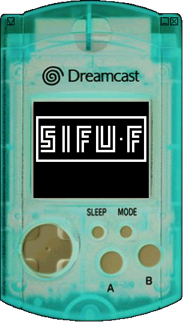
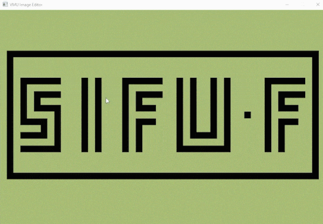

# VMU dev

#### Development on Sega's Visual Memory Unit in LC86 assembly



#### Assemble:
```
..\tools\waterbear.exe assemble snake.s -o snake.vms
```
The resulting binary can be run in a VMU emulator or on real hardware using DreamShell
#### Desktop app to design bitmap sprites for its 48×32 pixel display

#### Build:
```
cd vmu_graphics
mkdir build && cd build
cmake ..
cmake --build .
```
#### Controls:
```
C: clear screen
S: save bitmap to ASM
F: change foreground colour
B: change background colour
```
